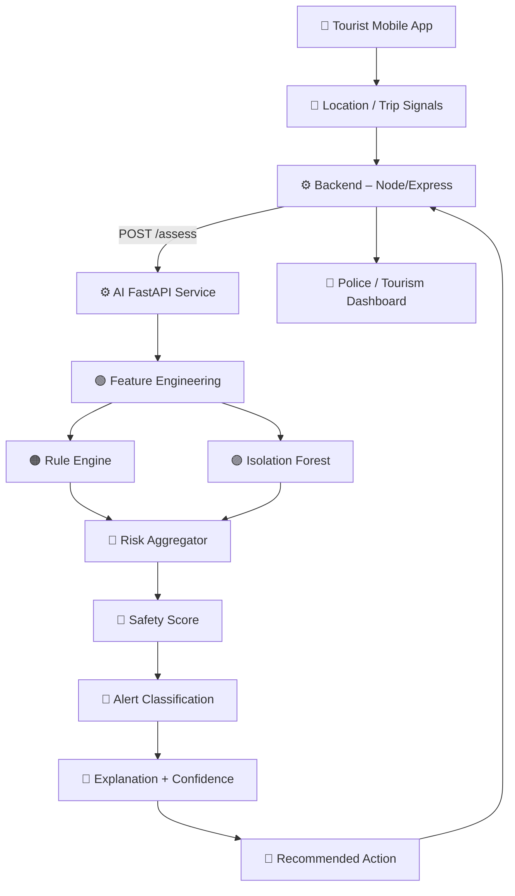
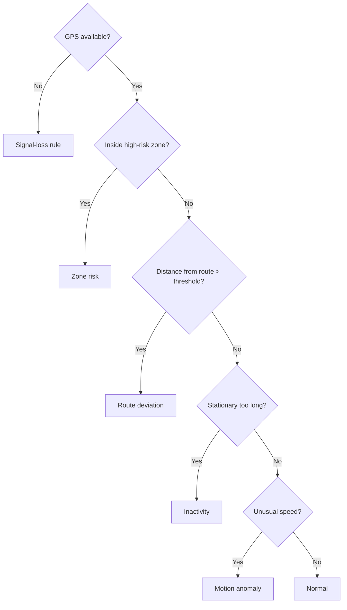
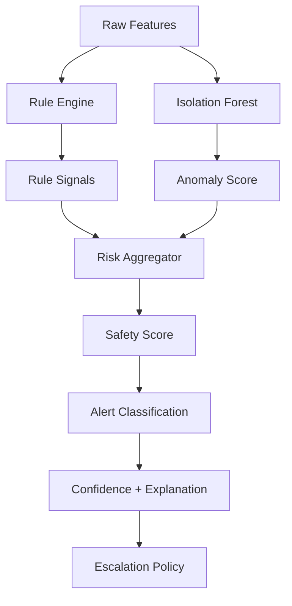
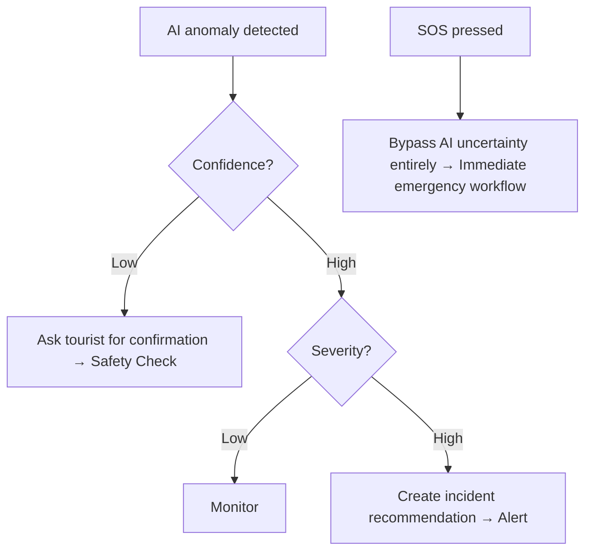

# AI/ML Implementation Blueprint

> **Implementation status (24 Aug 2026):** This is a planning/design document. The repository currently contains no standalone `ai-ml` runtime or FastAPI service. The Express backend has provider contracts for staff AI analysis and a tourist chatbot endpoint, but concrete AI providers are not configured in this snapshot.

### Smart Tourist Safety Monitoring & Incident Response System — SIH25002

> **Scope:** AI/ML service only (rules engine + Isolation Forest + safety score + alert classification + search/dispatch assistance). Blockchain, frontend, and the core Node/Express backend are referenced **only where the AI service must integrate with them**.
>
> **Core principle: AI recommends. Humans decide.** The AI service never auto-dispatches police, fire, medical, or rescue units — it returns a scored, explained recommendation that a human dispatcher acts on.

```
GPS + Context → Feature Window → Hybrid Detection → Explanation → Escalation
```

**Non-negotiable design principles** (carried from the project blueprint, §06/§06A/§07):
- Explainable AI — every score ships with reasons, never a bare number
- Hybrid detection — deterministic rules + Isolation Forest, not a single black box
- Synthetic, labelled journey data — no dependency on a large real tourist dataset
- Confidence + reasons on every output — low confidence asks the tourist first
- Privacy-aware processing — AI service touches location/context, never raw KYC/identity data
- Reliable FastAPI integration — rule engine keeps working if the ML model is degraded/unavailable
- Deterministic replay — every scenario can be re-run byte-for-byte for demo and evaluation
- Measurable evaluation — precision/recall/F1/false-alerts-per-trip, not vibes
- MVP first, advanced prediction (LSTM/transformers/nationwide models) later

---

## 1. AI/ML System Overview

**What the AI service owns vs. what it doesn't:**

| Owns (AI service) | Does NOT own |
|---|---|
| Feature engineering from location/trip signals | Raw KYC / identity data |
| Deterministic rule evaluation | Incident state machine (CREATED → RESOLVED) |
| Isolation Forest anomaly scoring | Dispatch, assignment, responder routing |
| Safety score + explanation + confidence | Blockchain anchoring |
| Alert category + severity recommendation | Final human decision to escalate |
| Search-area estimation for a lost/unresponsive tourist | Notification delivery (SMS/push) |

**End-to-end flow (component ownership):**

```
Tourist Mobile App
      │  GPS + trip/context signals
      ▼
Backend (Node/Express)                    ← source of truth, owns trips/incidents
      │  POST /assess  (AI_SERVICE_URL)
      ▼
AI FastAPI Service                        ← THIS BLUEPRINT
      │
      ├─ Feature Engineering  (movement / route / zone / connectivity / context)
      ├─ Rule Engine          (deterministic, versioned thresholds)
      ├─ Isolation Forest     (anomaly score on the feature vector)
      ├─ Risk Aggregator      (rules + ML → safety score)
      ├─ Alert Classification (category + severity + urgency)
      └─ Explanation + Confidence + Recommended Action
      │
      ▼
Backend (Node/Express)                    ← creates SafetyAssessment, may open Alert/Incident
      │
      ▼
Police / Tourism Dashboard                ← human dispatcher reviews and acts
```

Color/role legend used throughout this document: 🔵 input · 🟢 feature processing · 🟠 rules · 🟣 ML · 🔴 decision/recommendation · ⚙️ API · 🔷 output.

---

## 2. End-to-End Architecture



**Why this shape:** the backend (Node/Express + PostgreSQL) stays the durable source of truth for trips and incidents; the AI service is a stateless, horizontally-scalable Python microservice that only *scores and explains*. If it goes down, geofence and SOS rules that already live in the backend keep functioning (see §15 Failure Modes).

---

## 3. AI Feature Map

```
Raw Signals  →  Feature Extraction  →  Feature Vector
```

| Feature | Type | Group | Source | Purpose |
|---|---|---|---|---|
| `speedMps` | float | Movement | GPS delta | detect unusual speed / impossible jumps |
| `acceleration` | float | Movement | GPS delta | detect abrupt motion change |
| `stationaryDurationS` | int | Movement | GPS delta | detect inactivity |
| `distanceTraveledM` | float | Movement | GPS delta | trip-level movement summary |
| `directionChangeDeg` | float | Movement | GPS delta | detect erratic movement |
| `distanceFromGroupM` | float | Movement | multi-tourist trip | detect group separation |
| `distanceFromRouteM` | float | Route | planned route polyline | route deviation |
| `routeProgressPct` | float | Route | planned route polyline | is the tourist making progress |
| `repeatedDeviationCount` | int | Route | rolling window | filters one-off GPS noise |
| `zoneSeverity` | float (0–1) | Zone | RiskZone polygon | how dangerous the current zone is |
| `dwellDurationS` | int | Zone | zone entry timestamp | time spent inside a risk zone |
| `recentBoundaryCrossings` | int | Zone | geofence events | detects boundary flapping/erratic entry |
| `hazardExposureScore` | float | Zone | advisory feed | weather/fire/flood overlay |
| `secondsSinceTrustedPoint` | int | Connectivity | location trust flag | signal loss duration |
| `networkType` | enum | Connectivity | device context | offline vs cellular vs wifi |
| `gpsDropoutFlag` | bool | Connectivity | ingestion pipeline | marks a dropout window |
| `offlineDurationS` | int | Connectivity | sync queue | how long the device was offline |
| `localHour` | int | Context | device timestamp | night-time risk weighting |
| `travelMode` | enum | Context | trip profile | walking/driving/trekking tolerance |
| `batteryLevel` | int | Context | device telemetry | device reliability signal |
| `userCheckInMisses` | int | Context | check-in prompts | missed safety confirmations |

**Feature vector example** (what actually reaches the model):
```json
{
  "distanceFromRouteM": 780,
  "stationaryDurationS": 1900,
  "zoneSeverity": 0.9,
  "secondsSinceTrustedPoint": 420,
  "speedMps": 0.4,
  "distanceFromGroupM": 1600
}
```

---

## 4. Synthetic Data & Validation Pipeline

Real tourist emergency data won't exist for a hackathon prototype — the AI is trained and evaluated on **generated, labelled journeys**.

```
Route Template → Movement Generator → GPS Noise → Normal Trajectory → Scenario Mutation → Labeled Scenario
```

**Scenario types to generate:**

| Scenario | What it simulates | Sketch |
|---|---|---|
| `NORMAL` | ordinary walk/drive along the route | `A ──── B ──── C` |
| `ROUTE_DEVIATION` | tourist leaves the planned path | `A ──── B ╲` then `╲ X` |
| `INACTIVITY` | GPS stops updating position for a long window | flat trace, no displacement |
| `GPS_DROPOUT` | intermittent signal loss | `● ● ● ● ● ...... ● ●` (gap = missing data) |
| `GROUP_SEPARATION` | one member's trace diverges from the group centroid | two diverging traces |
| `RISK_ZONE_DWELL` | long dwell time inside a high-severity zone | clustered points inside polygon |
| `UNUSUAL_SPEED` | speed outside travel-mode tolerance | spike in `speedMps` |
| `IMPOSSIBLE_JUMP` | teleport-like coordinate change | discontinuous point pair |

**Module layout** (`apps/ai-service/data/`):
```
ai-service/
└── data/
    ├── generator.py     # route template → noisy trajectory
    ├── scenarios.py      # scenario mutation + labels
    └── replay.py         # streams saved traces through the live /assess API
```

**Data validation pipeline** — bad data is *flagged*, never silently dropped:
```
Raw GPS event
   → Schema validation
   → Timestamp validation
   → Coordinate validation
   → Accuracy validation
   → Out-of-order detection
   → Impossible-jump detection
   → Trusted / untrusted point
   → Feature window
```
| Invalid point type | Handling |
|---|---|
| Malformed schema / missing fields | reject |
| Accuracy worse than threshold (e.g. 50 m) | mark low-confidence, keep |
| Out-of-order timestamp | reject from ordering, keep for audit |
| Impossible jump (speed > physical max) | mark low-confidence, flag `impossibleJumpFlag` |

---

## 5. Feature Engineering Pipeline

```
Location history → Sliding time window → Movement features → Route features
→ Zone features → Connectivity features → Context features → Feature vector
```

- Window size and step are **configurable** (e.g. 5-minute sliding window, 30s step) — start with values that match the ~5–10 s location-ingestion frequency defined by the backend.
- Each feature group is a separate, independently testable module — this is exactly the split Person 2 (beginner) can own end-to-end (see §16).

```
ai-service/app/features/
├── movement.py
├── route.py
├── zone.py
├── connectivity.py
└── context.py
```

---

## 6. Rule Engine

Deterministic, versioned, and always runs — even if the ML model is unavailable.



| Rule | Input | Threshold (prototype — needs calibration) | Output | Severity |
|---|---|---|---|---|
| Signal loss | `secondsSinceTrustedPoint` | > 300 s | `SIGNAL_LOSS` | Medium |
| Zone risk | `zoneSeverity` | ≥ 0.7 | `ZONE_RISK` | High |
| Route deviation | `distanceFromRouteM` | > 500 m | `ROUTE_DEVIATION` | Medium |
| Inactivity | `stationaryDurationS` | > 1200 s | `INACTIVITY` | Medium |
| Motion anomaly | `speedMps` vs. travel-mode band | outside band | `MOTION_ANOMALY` | Low–Medium |

All thresholds live in a versioned config (`ruleVersion`), not hard-coded — they are **explicitly prototype values requiring calibration** against real evaluation data, not production safety guarantees.

---

## 7. Isolation Forest

```
Feature Vector → Isolation Forest → Anomaly Score → Normalized Score → Confidence
```

- **Normal movement** → dense, common region of the feature space (short isolation paths are hard to build → low anomaly score).
- **Anomalous movement** → isolated, unusual region (short isolation paths are easy to build → high anomaly score).

Covered explicitly, kept minimal:
- **Training data:** synthetic `NORMAL` journeys only (unsupervised — the model learns what "typical" looks like)
- **Contamination:** small assumed anomaly fraction (e.g. `0.05`), tuned during evaluation
- **Preprocessing:** scale/normalize numeric features before fitting
- **Prediction:** `decision_function` → normalized 0–1 anomaly score
- **Threshold:** versioned, separate from the rule-engine thresholds
- **Model version:** stamped on every response as `modelVersion`

```python
from sklearn.ensemble import IsolationForest
import numpy as np

FEATURE_ORDER = [
    "distanceFromRouteM", "stationaryDurationS", "zoneSeverity",
    "secondsSinceTrustedPoint", "speedMps", "distanceFromGroupM",
]

def train(X: np.ndarray) -> IsolationForest:
    model = IsolationForest(
        n_estimators=200,
        contamination=0.05,
        random_state=42,
    )
    model.fit(X)
    return model

def score(model: IsolationForest, feature_vector: dict) -> float:
    x = np.array([[feature_vector[k] for k in FEATURE_ORDER]])
    raw = -model.decision_function(x)[0]     # higher = more anomalous
    return float(np.clip((raw + 0.5), 0, 1))  # normalize to 0-1
```

Explicitly **out of scope for MVP**: LSTMs, transformers, or any deep-learning trajectory model — see §17.

---

## 8. Hybrid AI Pipeline

The single most important diagram in this blueprint — rules and ML are complementary, not competing:



- **Rules** catch *known* safety conditions with certainty and instant explainability (a rule firing IS the explanation).
- **Isolation Forest** catches *unusual combinations* that no single rule was written for.
- The aggregator never lets either side act alone — a rule with no anomaly support is still actionable (e.g. `ZONE_RISK`), and an anomaly with no rule match still needs a human-readable reason before it can escalate.

---

## 9. Safety Score + Alert Classification

**Explainable, stacked scoring — every component is always returned:**
```
Base = 100
  Zone Risk          -25
  Route Deviation    -20
  Inactivity         -15
  Signal Loss        -10
  Motion Anomaly      -10
  Time Risk            -5
                     -----
  Final Score          15
```
```python
def safety_score(zone_risk, route_risk, inactivity_risk,
                  connectivity_risk, motion_risk, context_risk) -> int:
    raw = 100 - zone_risk - route_risk - inactivity_risk \
              - connectivity_risk - motion_risk - context_risk
    return max(0, min(100, raw))
```
Rules: every component must be returned in the API response · every threshold must be versioned · the score must **never** be shown without its explanation.

**Alert classification:**
```
Risk signals → Severity → Urgency → Category → Recommended response
```
Categories: `POLICE` · `FIRE` · `MEDICAL` · `RESCUE` · `SAFETY_CHECK`

| Example signal combination | Result |
|---|---|
| High-risk zone + fire hazard + smoke/heat signal | `FIRE` / `CRITICAL` |
| Route deviation + inactivity + no check-in response | `SAFETY_CHECK` / `HIGH` |

```json
{
  "category": "SAFETY_CHECK",
  "severity": "HIGH",
  "recommendedResponseWindow": "10m"
}
```

---

## 10. Explainability + Escalation Policy

Every AI output must be understandable to a police dispatcher at a glance:

```
┌──────────────────────────────┐
│ Risk Score: 32                │
│ Severity: HIGH                │
│ Confidence: 0.87               │
├──────────────────────────────┤
│ Reasons                        │
│  • High-risk zone               │
│  • 780m route deviation          │
│  • 31m inactivity                 │
│  • GPS signal degraded             │
├──────────────────────────────┤
│ Recommended Action:              │
│  Request safety check              │
└──────────────────────────────┘
```

**Escalation decision tree:**


**Terminology, made visually/behaviorally distinct:**

| Level | Meaning | Behavior |
|---|---|---|
| `WARNING` | local, in-app only | geofence/zone notice; no backend incident created |
| `ANOMALY` | AI-scored, unconfirmed | triggers a safety check to the tourist first |
| `INCIDENT` | human-confirmed or high-confidence severe | reaches the dispatcher queue |

SOS is the one path that **never waits** on AI confidence — it always enters the emergency workflow immediately.

---

## 11. Search & Dispatch Assistance

The AI recommends a search starting point and responder — the human dispatcher makes the call.

```
Last trusted point → Time since last trusted signal → Movement context
→ Estimated search area → Nearest likely help point → Recommended responder → Human dispatcher
```

Returned to the dispatcher:
- last trusted location + location accuracy
- likely search radius
- nearby help points
- response recommendation
- concise incident summary

```json
{
  "lastTrustedLocation": { "latitude": 25.412, "longitude": 91.803, "accuracyMeters": 18 },
  "minutesSinceTrusted": 27,
  "estimatedSearchRadiusM": 850,
  "nearbyHelpPoints": ["Ranger Post – Dawki Road", "PHC Mawlynnong"],
  "recommendedResponder": "ResponderUnit_04 (nearest, on duty)",
  "incidentSummary": "Tourist deviated 780m from planned route, then stationary 31m with degraded GPS signal in a high-severity zone."
}
```

---

## 12. AI FastAPI Service Architecture

**Stack:** FastAPI · Python · Pydantic · scikit-learn · NumPy · Pandas — deployed as an optional microservice inside the monorepo (`apps/ai-service/`), matching the main architecture decision: *"Run AI as a small Python/FastAPI service only if the model requires scikit-learn."*

| Endpoint | Input | Output | Purpose |
|---|---|---|---|
| `POST /assess` | trip/location/context payload | risk score, anomaly, severity, category, reasons | primary scoring endpoint called by the backend |
| `POST /features` | raw location history | computed feature vector | debugging / offline evaluation |
| `POST /classify` | feature vector or score | category + severity | isolated classification step |
| `POST /search-area` | tripId, last trusted point | estimated search area + responder recommendation | §11 |
| `GET /health` | – | service + model status | used by the backend's `/health` aggregator |
| `GET /model-info` | – | model version, rule version, trained-on summary | judge-facing transparency |

**Integration boundary with the core backend** (from the project blueprint):
```
AI_SERVICE_URL=
AI_SERVICE_TOKEN=
AI_MODEL_VERSION=
```
The backend calls `POST /trips/:id/safety-assessments` internally, which in turn calls the AI service's `/assess` and persists a `SafetyAssessment` row — the AI service itself never writes to PostgreSQL or talks to the tourist app directly.

---

## 13. Exact AI API Contract

**Request** (`POST /assess`):
```json
{
  "tripId": "trip_123",
  "timestamp": "2026-08-19T10:42:00Z",
  "location": {
    "latitude": 25.4,
    "longitude": 91.8,
    "accuracyMeters": 12
  },
  "context": {
    "travelMode": "WALKING",
    "batteryLevel": 67
  }
}
```

**Response:**
```json
{
  "riskScore": 32,
  "anomaly": true,
  "confidence": 0.87,
  "severity": "HIGH",
  "category": "SAFETY_CHECK",
  "reasons": [
    "High-risk zone",
    "780m route deviation",
    "31m inactivity",
    "GPS signal degraded"
  ],
  "recommendedAction": "Request safety check",
  "modelVersion": "iforest-v1",
  "ruleVersion": "rules-v1"
}
```

---

## 14. Repository / Folder Structure

Nested inside the project's existing monorepo (`tourist-safety/apps/ai-service/`):

```
apps/ai-service/
│
├── app/
│   ├── main.py
│   ├── config.py
│   │
│   ├── api/
│   │   ├── assess.py
│   │   ├── features.py
│   │   └── health.py
│   │
│   ├── features/
│   │   ├── movement.py
│   │   ├── route.py
│   │   ├── zone.py
│   │   ├── connectivity.py
│   │   └── context.py
│   │
│   ├── rules/
│   │   ├── geofence.py
│   │   ├── inactivity.py
│   │   ├── deviation.py
│   │   └── movement.py
│   │
│   ├── models/
│   │   ├── isolation_forest.py
│   │   └── artifacts/
│   │
│   ├── risk/
│   │   ├── score.py
│   │   ├── classifier.py
│   │   └── escalation.py
│   │
│   └── schemas/
│
├── data/
│   ├── generator.py
│   ├── scenarios.py
│   └── replay.py
│
├── training/
├── evaluation/
├── replay/
├── tests/
└── README.md
```

---

## 15. Testing + Evaluation

**Scenario test matrix:**

| Scenario | Expected rule | Expected AI behavior | Expected score | Expected recommendation |
|---|---|---|---|---|
| `NORMAL` | none fires | low anomaly score | ~90–100 | no action |
| `HIGH_RISK_ZONE` | `ZONE_RISK` | moderate anomaly support | 40–60 | safety check |
| `ROUTE_DEVIATION` | `ROUTE_DEVIATION` | moderate anomaly | 50–70 | monitor / safety check |
| `INACTIVITY` | `INACTIVITY` | moderate–high anomaly | 40–60 | safety check |
| `GPS_DROPOUT` | `SIGNAL_LOSS` | low confidence | 50–70 | monitor, ask on reconnect |
| `GROUP_SEPARATION` | none (custom rule if added) | anomaly-driven | 60–75 | safety check |
| `UNUSUAL_SPEED` | `MOTION_ANOMALY` | anomaly support | 60–75 | monitor |
| `IMPOSSIBLE_JUMP` | flagged, low trust | high anomaly, low confidence | n/a until re-confirmed | request re-confirmation |
| `FALSE_ALARM` | rule may fire briefly | low sustained anomaly | recovers to 90+ | none (log as false-alarm feedback) |
| `SOS` | bypasses AI | n/a | n/a | immediate emergency workflow |

**Evaluation dashboard fields:** Precision · Recall · F1 · False alerts / trip · Time to detection.

**Train/test split — by route, never by point:**
```
GOOD                          BAD
Train: Trip A, Trip B, C      Train: points 1,2,3,5,6
Test:  Trip D, Trip E         Test:  point 4
```
Splitting by individual GPS point leaks the same trip's pattern into both sets and produces falsely high accuracy — always split whole routes/trips.

**Failure-mode handling:**
```
AI service unavailable → Rule engine still works → Mark AI status degraded → Continue deterministic safety features
```
Other handled failures: missing GPS · inaccurate GPS · stale location · impossible coordinate · model unavailable · low model confidence · backend unavailable · duplicate event.

---

## 16. Team Responsibility (AI/ML pod — 2 people)

| | **Person 1** — experienced (Python, FastAPI, AI integration, RAG, agents, backend/blockchain integration, Rust/Solana) | **Person 2** — beginner (basic Python, basic ML, basic web dev) |
|---|---|---|
| **Owns** | AI service architecture · FastAPI app · ML model integration · AI ↔ backend integration · model pipeline productionization · blockchain integration boundary | Synthetic data generator · feature engineering modules · deterministic rules · safety-score components · alert classification · evaluation · test scenarios · replay traces |

Advanced architecture responsibilities (service design, model productionization, backend integration contracts) stay with Person 1 — Person 2's ownership list is deliberately self-contained and independently testable.

**Person 2 learning staircase:**
```
Python fundamentals
      ↓
Pandas + NumPy
      ↓
GPS data
      ↓
Feature engineering
      ↓
Rule engine
      ↓
Scikit-learn basics
      ↓
Isolation Forest
      ↓
Evaluation
```
| Stage | What to learn | What to build |
|---|---|---|
| Python fundamentals | functions, dicts, typing | small scripts on sample GPS JSON |
| Pandas + NumPy | dataframes, vectorized ops | load a synthetic trace into a dataframe |
| GPS data | lat/lon, haversine distance, bearing | `distanceFromRouteM` helper |
| Feature engineering | sliding windows | one feature module (e.g. `movement.py`) |
| Rule engine | thresholds, config | one deterministic rule + its unit test |
| Scikit-learn basics | fit/predict, train/test split | fit a toy `IsolationForest` |
| Isolation Forest | contamination, decision_function | wire the real feature vector through it |
| Evaluation | precision/recall/F1 | scenario test matrix (§15) results |

---

## 17. Implementation Roadmap

```
1. Project setup
      ↓
2. Synthetic data
      ↓
3. Feature engineering
      ↓
4. Rule engine
      ↓
5. Isolation Forest baseline
      ↓
6. Safety score
      ↓
7. Alert classifier
      ↓
8. Explainability
      ↓
9. FastAPI
      ↓
10. Backend integration
      ↓
11. Replay system
      ↓
12. Evaluation
      ↓
13. Demo hardening
```
Steps 3–7 can run largely in parallel across the two-person pod once the feature schema (step 2's output) is frozen; step 9 (FastAPI) can be scaffolded in parallel with step 3 using mock responses.

**Aligned to the project's actual AI/Blockchain day plan:**

| Dates | AI deliverable |
|---|---|
| 21–22 Aug | Feature schema + synthetic traces |
| 23–24 Aug | Geofence / rule engine + tests |
| 25–26 Aug | Model baseline + explanation API |
| 27–28 Aug | Replay evaluation + thresholds |
| 29–30 Aug | Failure tests + metric charts |
| 31 Aug | Freeze model/rules |

**Explicitly future scope — do NOT build for MVP:**
LSTM / Transformers · deep-learning trajectory prediction · nationwide predictive crime model · real government APIs · real Aadhaar integration · production 112 integration · complex autonomous AI agents · LLM-based autonomous dispatch.

---

## 18. Final Demo Flow

```
Tourist starts trip
       ↓
Normal movement
       ↓
Enters risk zone → Geofence warning
       ↓
Leaves planned route
       ↓
Inactivity detected
       ↓
AI anomaly score increases → Safety score drops
       ↓
AI explains why (reasons + confidence)
       ↓
Safety check sent → No response
       ↓
High-priority incident recommendation
       ↓
Police dashboard receives alert
```
**SOS path (parallel, always fastest):**
```
SOS → Immediate emergency workflow → No AI waiting period
```

### Final checklist

- **Data** — synthetic generator · scenarios · replay traces
- **Features** — movement · route · zone · connectivity · context
- **AI** — rules · Isolation Forest · score · classification · confidence · explanation
- **API** — `/assess` · `/features` · `/classify` · `/search-area`
- **Testing** — unit tests · scenario tests · evaluation · replay
- **Integration** — backend · realtime events · dashboard
- **Demo** — deterministic replay · failure backup · metrics

```
        AI SAFETY ENGINE

GPS + Trip Signals
       ↓
Feature Engineering
       ↓
Rules + Isolation Forest
       ↓
Risk Score
       ↓
Classification
       ↓
Confidence + Explanation
       ↓
Recommended Action
       ↓
   HUMAN REVIEW
       ↓
 INCIDENT RESPONSE

    AI recommends. Humans decide.
```
## Blockchain/QR integration boundary

AI/ML services must not consume QR JWTs, gateway API keys, issuer private keys, or raw blockchain credentials. If a future risk model needs identity context, the backend should pass only the minimum internal trip/user identifiers required for inference. Blockchain verification remains an API/backend responsibility.

## Current runtime escalation boundary

The production safety flow preserves the principle that AI does not auto-dispatch responders. A danger-zone event notifies the tourist and Disaster Management. Group-member signal loss is handled by the deterministic backend `SignalLossCase` workflow (default 5-minute gap, 5-minute leader decision, 5-minute reminder after a handled response). Police/Fire/Ambulance assignment begins only after Disaster Management initiates dispatch; AI may recommend severity/resources but does not bypass that human-controlled boundary.

## Latest Rakshak AI integration

Rakshak AI runs as a separate authenticated service under `ai-ml/`. It validates the same access JWT issued by the main Kavach backend (`JWT_ISSUER=smart-tourist-safety`, `JWT_AUDIENCE=smart-tourist-safety-client` by default), uses the maintained Markdown knowledge base in `ai-ml/kb/`, and persists user-scoped conversations/messages in PostgreSQL. Clearing chat hides prior messages from that user's UI without deleting the stored database history. Disaster Management also has authenticated provisioning for Police, Fire, and Ambulance/Hospital responder accounts; responders subsequently use the normal login flow.


## Current routing behavior

- Normal conversation does not require a KB match.
- Kavach-specific questions use matching Markdown knowledge when available.
- Recent persisted per-user chat history is always supplied as conversation context.
- Nearest-safe-zone questions use live data from the main Kavach API rather than asking the model to infer places from coordinates.
- Configure `KAVACH_API_URL` on the AI service to the main backend URL including `/api/v1`.

## 2026-08-27 implementation status

The current implementation has moved beyond a static FAQ chatbot. Implemented runtime capabilities include authenticated user-scoped history, Groq completion, KB selection, live safe-zone lookup, browser-location context, and private authenticated-user enrichment with a minimized-field policy.

Remaining AI work should preserve the current boundary: shared product facts belong in the KB, live operational facts come from authenticated APIs, and private profile data is injected only for the current authenticated user.

---

## Repository synchronization — 2026-08-27

Implementation has progressed beyond the original blueprint: authenticated user-aware chatbot context, KB routing, live safety context, and account-scoped history are present in the repository. Future work should preserve strict user isolation and treat backend data as authoritative for live operations.
