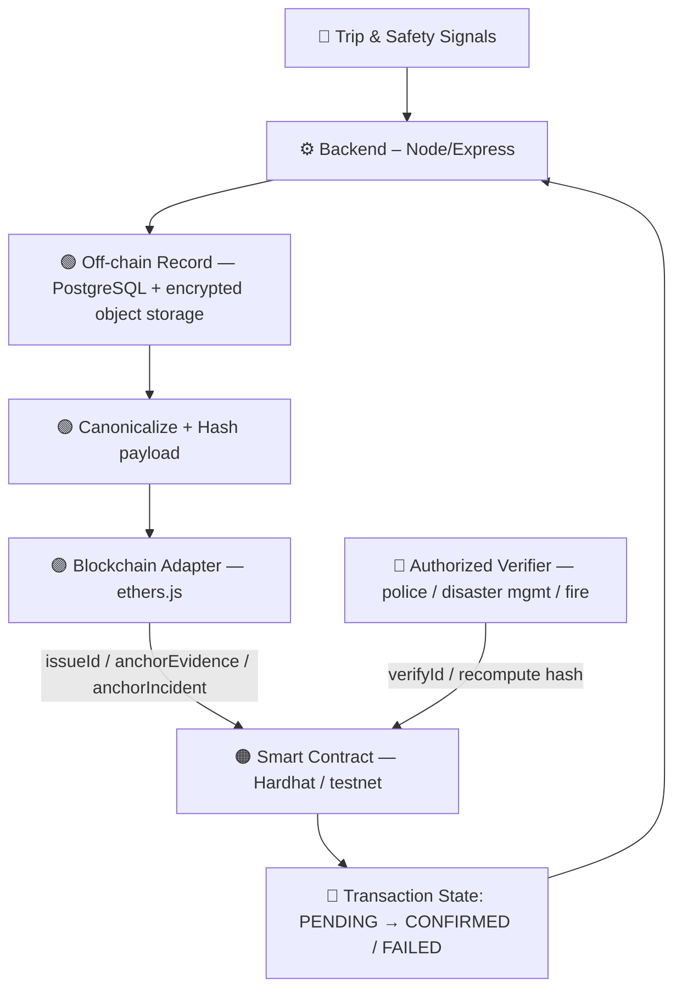
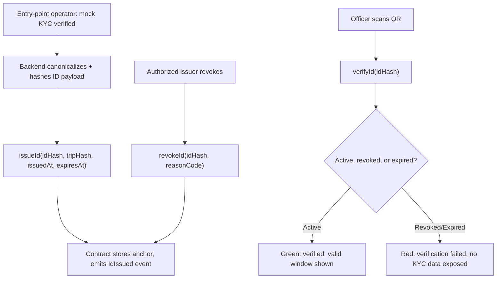
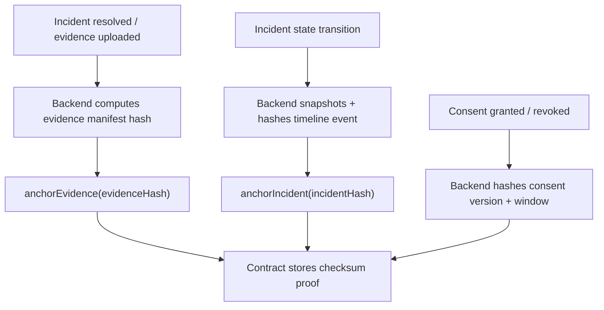
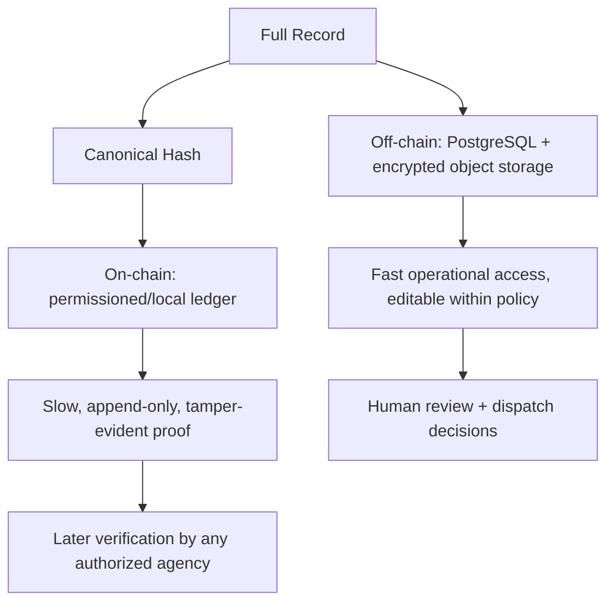
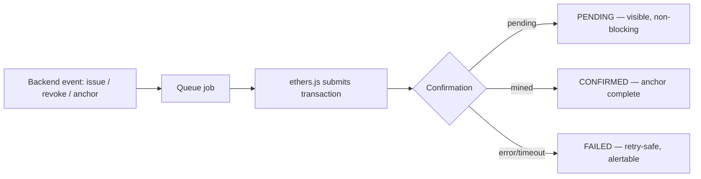
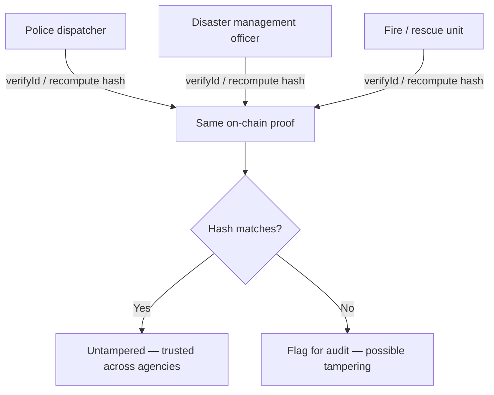

# Blockchain Trust Layer — Implementation Blueprint

> **Current workflow:** Read [`workflow.md`](workflow.md) first for the repository's live credential integration and terminology. This document then covers its narrower deployment/design topic.


> **Documentation status (24 Aug 2026):** Retained as design/deployment history. The current server integration uses the isolated authenticated HTTP gateway (`blockchain/gateway/server.ts`), not an in-process adapter import into `server/`.

### Smart Tourist Safety Monitoring & Incident Response System — SIH25002

> **Scope:** the blockchain trust layer only (digital ID anchoring, evidence/incident integrity, consent receipts, inter-agency verification). PostgreSQL, the tourist/authority frontends, and the AI service are referenced **only where the trust layer must integrate with them**.
>
> **Core principle: blockchain stores proofs, not data.** The chain never holds a name, phone number, identity document, GPS coordinate, photo/video, medical record, or login credential — it holds a hash, a timestamp, a signer, and a version.

```
Trip & Safety Signals → Off-Chain Record (PostgreSQL) → Canonical Hash → On-Chain Anchor → Inter-Agency Verification
```

**Non-negotiable design principles** (carried from the project blueprint, §06A/§07):
- Blockchain is a **trust anchor**, not a database for tourist identity or live location
- Hash canonical, **versioned** payloads — the same data always produces the same digest
- Salt or otherwise protect low-entropy identifiers before hashing
- Store transaction hash, chain/network, contract version, and confirmation status in PostgreSQL
- Queue blockchain work — **SOS and dispatch never wait on chain confirmation**
- Local Hardhat chain for deterministic judging; a public testnet transaction is optional, secondary evidence
- Backend-controlled issuer account signs transactions — tourists never install a wallet
- Raw PII and GPS coordinates never go on-chain, under any circumstance

---

## 1. Blockchain Trust Layer — Overview

**What the trust layer owns vs. what it doesn't:**

| Owns (Blockchain / Trust Layer) | Does NOT own |
|---|---|
| Digital ID issuance/revocation *proof* (hash + validity window) | The KYC document itself, name, contact details |
| Evidence checksum anchoring (chain of custody) | Evidence file bytes (stay in encrypted object storage) |
| Incident timeline integrity hash (tamper detection) | Incident notes, dispatcher decisions, case content |
| Consent version + access receipts | The consent UI, or the decision to share |
| Inter-agency verification of the same record proof | Live location, exact GPS history |
| Asynchronous transaction state (`PENDING`/`CONFIRMED`/`FAILED`) | The SOS/dispatch workflow itself — never blocked by chain |

**Judge-ready one-liner:** *PostgreSQL provides fast operational data. Blockchain anchors only verification-critical hashes, so an issued ID or a finalized evidence record can later be checked for tampering without exposing any personal information.*

---

## 2. End-to-End Architecture



| Step | Component | Responsibility |
|---|---|---|
| 1 | Trip & safety signals | GPS + accuracy, group context, itinerary, check-ins, SOS |
| 2 | AI safety engine | (separate blueprint) risk score + reason + category |
| 3 | Human review | disaster manager verifies and approves the dispatch |
| 4 | Full record stays off-chain | PostgreSQL + encrypted object storage — contains PII, GPS, evidence |
| 5 | Hash proof anchored | permissioned/local blockchain stores hash + time + signer + version |
| 6 | Authorized verification | agencies recompute and compare hash → match = untampered record |

**AI output = recommendation, not final authority. Blockchain proof = integrity, not data storage.**

---

## 3. On-Chain vs Off-Chain Data Map

| Off-chain (PostgreSQL + encrypted object storage) | On-chain (permissioned/local ledger — hash only) |
|---|---|
| Name and contact | Tourist ID hash |
| KYC document reference | Trip hash |
| Exact location history | Issue and expiry timestamps |
| Emergency contacts | Revocation state |
| Evidence files (photo/video/document bytes) | Evidence checksum |
| Police notes | Audit anchor (Merkle root of audit events) |

**Never on-chain, under any framing:** name, phone number, identity documents, GPS coordinates, photos/videos, medical information, login credentials.

---

## 4. Trust Feature Map

```
Off-chain record → Canonicalize → Hash → Anchor → Verify
```

| # | Feature | What it proves | Anchored fields |
|---|---|---|---|
| 1 | **Trip Safety ID Proof** | ID authenticity, status, expiry, revocation — without exposing documents | `idHash`, `tripHash`, `issuedAt`, `expiresAt` |
| 2 | **Consent & Access Receipts** | Who was authorized to see what, for how long, and that it was revoked | consent version hash, sharing start/stop, expiry, authorized org + role |
| 3 | **Incident Timeline Integrity** | Creation/assignment/status/closure snapshots weren't tampered with or backdated | hashed snapshot per state transition |
| 4 | **Evidence Chain of Custody** | A downloaded evidence file is bit-for-bit the original | evidence manifest hash, actor, org, transfer timestamp, version |
| 5 | **Inter-Agency Verification** | Disaster management, police, and fire all verify the *same* record proof | signed hand-offs/approvals via trusted agency keys |
| 6 | **Audit & Privacy Architecture** | A periodic, tamper-evident summary of all audit events | Merkle root of audit events (hash, record ID, time, signer, version) |

---

## 5. Payload Canonicalization & Hashing

Hashing raw fields directly is fragile (field order, whitespace, type formatting all change the digest) — always hash a **canonical, versioned** representation.

```python
import hashlib
import json

def canonicalize(payload: dict, version: str) -> bytes:
    """Deterministic, versioned JSON canonicalization before hashing."""
    envelope = {"version": version, "data": payload}
    return json.dumps(envelope, sort_keys=True, separators=(",", ":")).encode("utf-8")

def hash_payload(payload: dict, version: str, salt: str | None = None) -> str:
    raw = canonicalize(payload, version)
    if salt:
        raw = salt.encode("utf-8") + raw
    return "0x" + hashlib.sha256(raw).hexdigest()
```

- **Low-entropy identifiers** (e.g. a short tourist ID or a simple sequence number) are salted before hashing so they can't be brute-forced back from the on-chain digest.
- **Every hash carries a `version`** field tied to the contract/schema version — a future field addition never silently invalidates old proofs.

---

## 6. Smart Contract Design — Digital ID



| Operation | Purpose | Who can call it |
|---|---|---|
| `issueId(idHash, tripHash, issuedAt, expiresAt)` | authorized issuer creates a verification anchor | `ENTRY_POINT_OPERATOR`-signed backend transaction |
| `revokeId(idHash, reasonCode)` | authorized issuer changes status; **reason text stays off-chain** | issuer / admin |
| `verifyId(idHash)` | returns issuer, active/revoked state, validity window | any authorized verifier (read-only) |

---

## 7. Smart Contract Design — Evidence, Incident & Consent Anchoring



| Operation | Purpose |
|---|---|
| `anchorIncident(incidentHash)` | stores the final incident/audit digest asynchronously — proves the timeline wasn't edited after close |
| `anchorEvidence(evidenceHash)` | proves a file checksum existed at a point in time, without publishing its bytes |
| Consent receipts | same canonicalize→hash→anchor pattern, keyed to `(tripId, consentVersion, sharingWindow)` |

**Recompute-to-verify pattern** (used for all three): download the off-chain record → canonicalize with the same version → hash it → compare against the on-chain digest. A mismatch means tampering, deletion, or backdating.

---

## 8. Hybrid Trust Architecture

Off-chain storage and on-chain anchoring are complementary — neither replaces the other:



- **PostgreSQL** is fast, queryable, and holds everything the operational workflow needs.
- **The chain** is slow and append-only on purpose — it only needs to answer one question later: *"does this record match what was anchored?"*
- Neither side ever blocks the other: SOS/dispatch runs entirely on PostgreSQL; the chain anchor is a queued, asynchronous follow-up.

---

## 9. Privacy & Salting Design

| Concern | Rule |
|---|---|
| Raw PII on-chain | never — not even encrypted; only hashes leave the backend |
| Exact GPS on-chain | never |
| Low-entropy IDs | salted before hashing to prevent brute-force reversal |
| Reason codes / notes | reason **codes** may anchor for audit; free-text reasons stay off-chain |
| Consent scope | hash proves *that* consent existed and its window — not *who* was told what, beyond org + role |
| On-chain inspection | a documented checklist step — literally open the deployed contract/chain and confirm no PII or GPS fields exist in any anchored payload |

---

## 10. Backend Adapter & Transaction Lifecycle



- Blockchain transaction state is **asynchronous**: `PENDING`, `CONFIRMED`, or `FAILED` — stored in PostgreSQL alongside the record it anchors.
- **Never block SOS or incident closure on chain confirmation** — the operational workflow completes; the anchor catches up.
- Retries are idempotent: resubmitting a job for an already-anchored hash is a no-op, not a duplicate anchor.

```javascript
// blockchain/scripts/adapter.js (pattern, not full implementation)
const { ethers } = require("ethers");

async function anchorEvidence(evidenceHash) {
  const tx = await contract.anchorEvidence(evidenceHash);
  await db.updateAnchorState(evidenceHash, "PENDING", tx.hash);
  const receipt = await tx.wait();               // never awaited inline on the SOS path
  await db.updateAnchorState(evidenceHash, receipt.status ? "CONFIRMED" : "FAILED", tx.hash);
}
```

**Environment variables** (from the project blueprint):
```
CHAIN_RPC_URL=
CONTRACT_ADDRESS=
ISSUER_PRIVATE_KEY=
CHAIN_ID=
```

---

## 11. Inter-Agency Verification Flow



- All agencies verify the **same** anchored proof — no agency has to trust another agency's copy of the record, only the shared chain.
- Trusted agency keys sign hand-offs/approvals; a permissioned ledger holds an agency/key revocation registry so a compromised agency key can be retired without redeploying the contract.

---

## 12. Failure Handling / Chain Outage Resilience

```
Blockchain node unavailable
        ↓
Anchor jobs queue (PENDING)
        ↓
Incident close / evidence upload proceed normally
        ↓
Anchor state shown as "pending" in the UI — never hidden
        ↓
Retry when the node/RPC recovers
```

| Failure | Handling |
|---|---|
| Chain node down | queue the anchor job; operational workflow (SOS, dispatch, incident close) is unaffected |
| RPC timeout | retry with backoff; transaction stays `PENDING` |
| Transaction reverted | mark `FAILED`, alert, allow manual re-submission |
| Contract upgrade needed | version the contract; old anchors remain independently verifiable against the version they were made under |

**Demo drill (from the project blueprint):** stop the blockchain node mid-incident, resolve the incident, and confirm the anchor remains `PENDING` without blocking closure.

---

## 13. Minimal Contract Surface

```solidity
// contracts/TrustAnchor.sol — minimal illustrative interface
pragma solidity ^0.8.19;

contract TrustAnchor {
    enum IdStatus { ACTIVE, REVOKED, EXPIRED }

    struct DigitalId {
        bytes32 tripHash;
        uint64  issuedAt;
        uint64  expiresAt;
        IdStatus status;
        address issuer;
    }

    mapping(bytes32 => DigitalId) public ids;          // idHash => record
    mapping(bytes32 => bool) public evidenceAnchors;    // evidenceHash => exists
    mapping(bytes32 => bool) public incidentAnchors;    // incidentHash => exists

    event IdIssued(bytes32 indexed idHash, address indexed issuer);
    event IdRevoked(bytes32 indexed idHash, uint8 reasonCode);
    event EvidenceAnchored(bytes32 indexed evidenceHash);
    event IncidentAnchored(bytes32 indexed incidentHash);

    function issueId(bytes32 idHash, bytes32 tripHash, uint64 issuedAt, uint64 expiresAt) external onlyAuthorizedIssuer { /* ... */ }
    function revokeId(bytes32 idHash, uint8 reasonCode) external onlyAuthorizedIssuer { /* ... */ }
    function verifyId(bytes32 idHash) external view returns (IdStatus, address, uint64, uint64) { /* ... */ }
    function anchorIncident(bytes32 incidentHash) external onlyAuthorizedIssuer { /* ... */ }
    function anchorEvidence(bytes32 evidenceHash) external onlyAuthorizedIssuer { /* ... */ }
}
```

**Example verification response (returned to the backend, then to the UI):**
```json
{
  "idHash": "0x7f3a...c21",
  "status": "ACTIVE",
  "issuer": "0xEntryPointOperator...",
  "issuedAt": "2026-08-19T09:00:00Z",
  "expiresAt": "2026-08-26T09:00:00Z",
  "chain": "hardhat-local",
  "contractVersion": "trust-anchor-v1"
}
```

---

## 14. Repository Structure

Nested inside the project's existing monorepo:

```
blockchain/
├── contracts/
│   └── TrustAnchor.sol
├── scripts/
│   ├── deploy.js
│   ├── issue.js
│   ├── verify.js
│   └── anchor.js
└── test/
    ├── issueRevoke.test.js
    ├── evidenceAnchor.test.js
    └── incidentAnchor.test.js
```

Backend-side adapter lives with the core service, not inside `blockchain/`:
```
apps/api/app/trust/
├── canonicalize.js
├── hasher.js
├── adapter.js          # ethers.js, job queue, PENDING/CONFIRMED/FAILED
└── verify.js
```

---

## 15. Testing + Security

| Test layer | Coverage | Tool |
|---|---|---|
| Unit | canonicalization determinism, hash stability, salt handling | Hardhat / Node test runner |
| Contract | issue → verify → revoke → verify-again state machine | Hardhat |
| Contract | anchor idempotency (re-anchoring same hash is a no-op) | Hardhat |
| Adapter | transaction state transitions (`PENDING`→`CONFIRMED`/`FAILED`) | mocked provider |
| Integration | incident close proceeds while chain is down; anchor recovers on retry | seeded services, failure drill |
| Privacy | on-chain inspection checklist — no PII/GPS field in any anchored payload | manual + automated scan of emitted events |
| Security | issuer-key-only write access; unauthorized address cannot `issueId`/`revokeId` | Hardhat access-control tests |

**On-chain inspection checklist (run before every demo):**
- [ ] No name, phone, or contact field in any anchored payload
- [ ] No raw GPS coordinate in any anchored payload
- [ ] No evidence file bytes on-chain — checksum only
- [ ] Every anchor carries a `version`
- [ ] Reason text for revocation is off-chain; only `reasonCode` is anchored

---

## 16. Team Responsibility

Mapped to the project blueprint's **AI + Blockchain engineer** workstream (§08A) and the six-member allocation (§08B — Member 6: Blockchain + QA/DevOps, backup: Backend):

| Workstream | Responsibility | Definition of done |
|---|---|---|
| Blockchain contract | Implement ID issue/revoke/verify and evidence/incident anchor operations | Contract tests + deployment record |
| Privacy design | Canonicalize and hash protected payloads; confirm no PII/exact location reaches the chain | On-chain inspection checklist passes |
| Backend adapter | ethers.js, asynchronous job state, retry-safe transaction submission | Pending/confirmed/failed states implemented |
| Demo proof | One verified QR ID, one revocation, one evidence hash comparison | Deterministic script + backup output |

**Boundaries with other developers:**
- Frontend consumes verification status; it never recalculates hashes or reimplements chain logic.
- Backend owns identity, authorization, and durable state; the trust layer only anchors and verifies.
- Blockchain failure **never** blocks SOS, dispatch, or incident closure.
- The specialist supplies mock verification responses early so frontend/backend integration isn't blocked on the contract being finished.

---

## 17. Implementation Roadmap

```
1. Contract fields + local Hardhat setup
      ↓
2. Issue / verify / revoke contract tests
      ↓
3. Backend adapter + transaction states
      ↓
4. Evidence / incident anchors + privacy inspection
      ↓
5. Demo script, testnet optional, backup proof
      ↓
6. Freeze contract and deployment metadata
```

**Aligned to the project's actual AI/Blockchain day plan:**

| Dates | Blockchain deliverable |
|---|---|
| 21–22 Aug | Contract fields + local Hardhat setup |
| 23–24 Aug | Issue/verify/revoke contract tests |
| 25–26 Aug | Backend adapter + transaction states |
| 27–28 Aug | Evidence/incident anchors + privacy inspection |
| 29–30 Aug | Demo script, testnet optional, backup proof |
| 31 Aug | Freeze contract and deployment metadata |

**Explicitly future scope — do NOT build for MVP:**
public mainnet deployment · tourist-managed wallets · on-chain storage of any PII/GPS/evidence bytes · cross-chain federation · production government PKI integration.

---

## 18. Final Demo Flow + Checklist

```
Entry operator issues fictional tourist ID
       ↓
Backend hashes ID payload → issueId() on local Hardhat chain
       ↓
Officer scans QR → verifyId() → ACTIVE, valid window shown
       ↓
Issuer revokes the ID → revokeId(reasonCode)
       ↓
Officer scans again → REVOKED, no KYC data exposed
       ↓
Incident resolved → evidence file uploaded → anchorEvidence(hash)
       ↓
Auditor downloads evidence → recomputes hash → compares to on-chain digest
       ↓
Match confirmed → tamper-evident proof demonstrated
```

**Judge Q&A, ready-made:**

| Question | Answer |
|---|---|
| Why blockchain? | Only for tamper-evident ID/evidence hashes across organizations. Operational data stays in PostgreSQL. |
| What if the chain is down? | Async queue and visible pending status — SOS and dispatch are never blocked. |
| Is government integration live? | No. The prototype uses documented adapters and mocks external systems honestly. |
| Can a tourist's identity be reconstructed from the chain? | No — only salted hashes and validity windows are anchored, never the underlying document or PII. |

### Final checklist

- **Contract** — `issueId` · `revokeId` · `verifyId` · `anchorIncident` · `anchorEvidence`
- **Privacy** — canonicalization · salting · on-chain inspection checklist passed
- **Adapter** — PENDING/CONFIRMED/FAILED states · retry-safe · never blocks SOS
- **Testing** — contract tests · adapter tests · chain-outage failure drill
- **Integration** — backend hash pipeline · dispatcher/auditor verification UI
- **Demo** — issue → verify → revoke → verify → evidence hash comparison, deterministic and reproducible

```
      BLOCKCHAIN TRUST LAYER

Off-chain Record (PostgreSQL)
        ↓
Canonicalize + Hash
        ↓
On-Chain Anchor (Hardhat / testnet)
        ↓
Inter-Agency Verification
        ↓
   TAMPER-EVIDENT PROOF

  Blockchain stores proofs, not data.
```