# KAVACH Backend Services Flow Guide

This document explains the important backend technologies and services used by KAVACH in simple language. It is designed for SIH demos, project reviews, and viva questions where the team may need to explain **what a service does, where it is used, and how data moves through it**.

> **Important:** This guide describes the current backend implementation. Some packages or adapter files exist in the repository but are not part of the active runtime; those are called out clearly instead of pretending every dependency is magically doing important work.

---

## 1. Overall Backend Request Flow

Most normal API requests follow the same layered path.

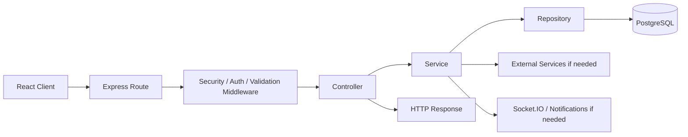

### What each layer means

| Layer | Simple meaning |
|---|---|
| Route | Decides which code handles a URL and HTTP method. |
| Middleware | Checks security, login, role, rate limits, and request data before feature logic runs. |
| Controller | Reads the HTTP request and calls the correct service function. |
| Service | Contains the actual business rules of the feature. |
| Repository | Reads and writes data using Prisma. |
| PostgreSQL | Permanent source of truth for application data. |

**Where it is used:** Almost every module under `server/src/modules/`.

**SIH explanation:** “Our backend follows a layered architecture so HTTP handling, business logic, and database logic stay separate and easier to maintain.”

---

# Core Infrastructure Services

## 2. PostgreSQL + Prisma ORM

PostgreSQL stores the permanent application state: users, trips, groups, tracking points, incidents, dispatches, notifications, credentials, audit records, and other operational data. Prisma is the ORM used by repositories to query that database without writing raw SQL for normal operations.

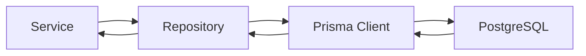

### How it works

1. `server/src/config/database.js` creates the Prisma client using the PostgreSQL adapter.
2. The server connects to PostgreSQL before accepting traffic.
3. Feature repositories call Prisma methods such as `findUnique`, `findMany`, `create`, `update`, and transactions.
4. PostgreSQL remains the source of truth even when Redis or Socket.IO is used.
5. During shutdown, the backend closes the Prisma connection cleanly.

### Important files

- `server/prisma/schema.prisma`
- `server/src/config/database.js`
- `server/src/modules/*/*.repository.js`

**SIH explanation:** “PostgreSQL is our authoritative database and Prisma is the layer through which our backend safely reads and writes relational data.”

---

## 3. JWT Authentication

KAVACH uses JSON Web Tokens to prove who is making a request. Access tokens are short-lived API credentials; refresh tokens are tied to stored sessions and are used to obtain a new access token.

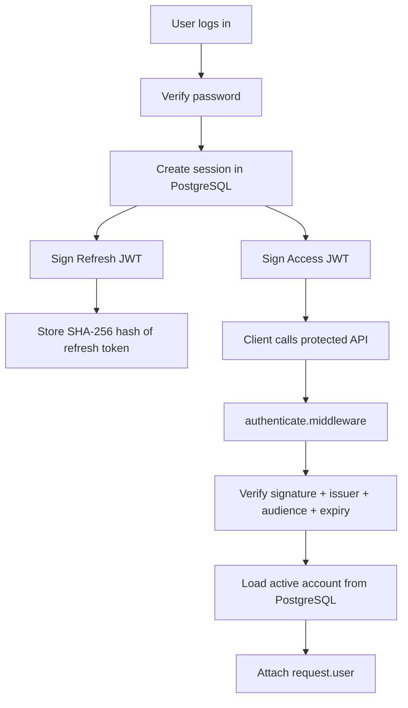

### What is inside an access token?

The backend signs information such as:

- user ID in `sub`
- account role
- token type (`access`)

The JWT uses **HS256**, a configured issuer, audience, and separate access-token secret.

### Why the backend still checks PostgreSQL

A mathematically valid JWT does not guarantee that the account should still have access. `authenticate.middleware.js` also verifies that the account still exists, is active, and, for tourists, has a verified email.

### Refresh-token security

The raw refresh token is not stored in the session table. The backend stores its **SHA-256 hash**, then compares hashes during refresh. Refresh tokens are rotated after use.

### Important files

- `server/src/common/utils/jwt.js`
- `server/src/middleware/authenticate.middleware.js`
- `server/src/modules/auth/auth.service.js`

**SIH explanation:** “JWT authenticates requests, but we still check the account in PostgreSQL so a disabled or deleted account cannot keep using an old valid token.”

---

## 4. Argon2 Password Security

Passwords are never stored as plain text. KAVACH uses **Argon2id** to convert the password into a slow, memory-hard hash before saving it.

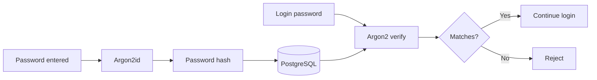

### Current hashing settings

The implementation uses Argon2id with configured memory/time work in `password.js`. Argon2 is intentionally expensive compared with a normal hash so stolen password hashes are harder to brute-force.

### Important file

- `server/src/common/utils/password.js`

**SIH explanation:** “We use Argon2id instead of storing or simply SHA-hashing passwords because Argon2 is specifically designed for secure password hashing.”

---

## 5. OTP + Session Security

Email verification and password reset use short-lived OTPs. The backend does not rely only on the six-digit value: it combines OTPs with secret/context data and stores hashes, enforces expiry, resend cooldowns, and attempt limits.

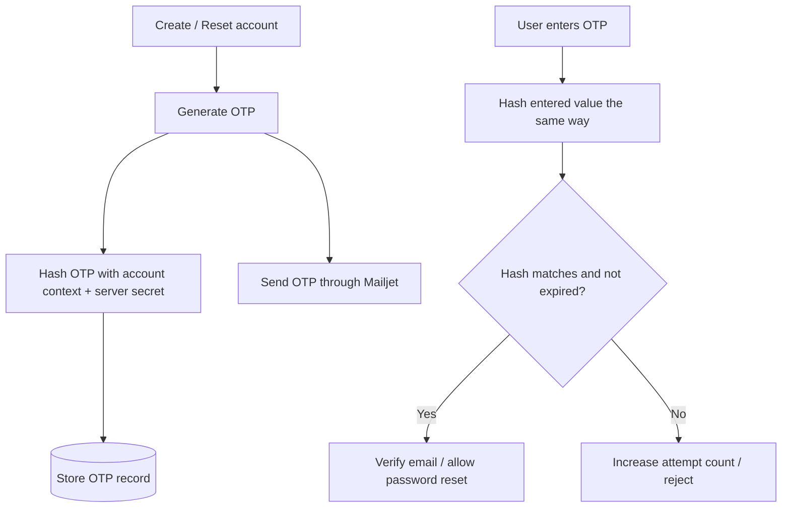

**Where it is used:** Email verification and forgot-password flows.

**Important file:** `server/src/modules/auth/auth.service.js`

---

# Communication Services

## 6. Mailjet Transactional Email Service

KAVACH sends email using the **Mailjet Send API v3.1 over HTTPS**. It does **not** use Mailjet SMTP in the current implementation.

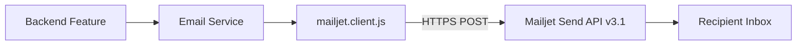

### How authentication works

The backend creates an HTTP Basic Authorization header using:

- `MAILJET_API_KEY`
- `MAILJET_SECRET_KEY`

The sender address comes from `MAILJET_SENDER_EMAIL`.

### Where email is used

Mailjet is used for flows including:

- email verification OTP
- password reset OTP
- trip-ending reminders
- incident notifications to Disaster Management
- danger-zone alerts
- solo signal-loss safety confirmation
- group signal-loss alerts
- group centroid-separation alerts to both the separated member and leader
- dispatch assignment notifications

### Group separation email flow

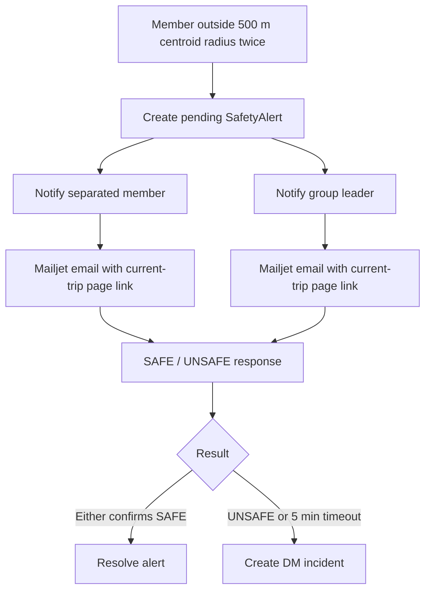

### Important files

- `server/src/integrations/notifications/mailjet.client.js`
- `server/src/modules/auth/email.service.js`
- `server/src/integrations/notifications/emergency-email.service.js`
- `server/src/modules/notification/notification.service.js`

> `nodemailer` currently appears in `package.json`, but the active transactional email path calls Mailjet directly with `fetch`. Do not describe the current system as Nodemailer/SMTP unless the implementation changes.

**SIH explanation:** “Transactional emails are server-to-server HTTPS requests to Mailjet, so provider secrets never go to the browser.”

---

## 7. Socket.IO / WebSocket Realtime Service

Socket.IO gives KAVACH real-time updates without making the browser continuously ask the REST API whether something changed. It supports WebSocket and polling transport, with reconnection/state-recovery support.

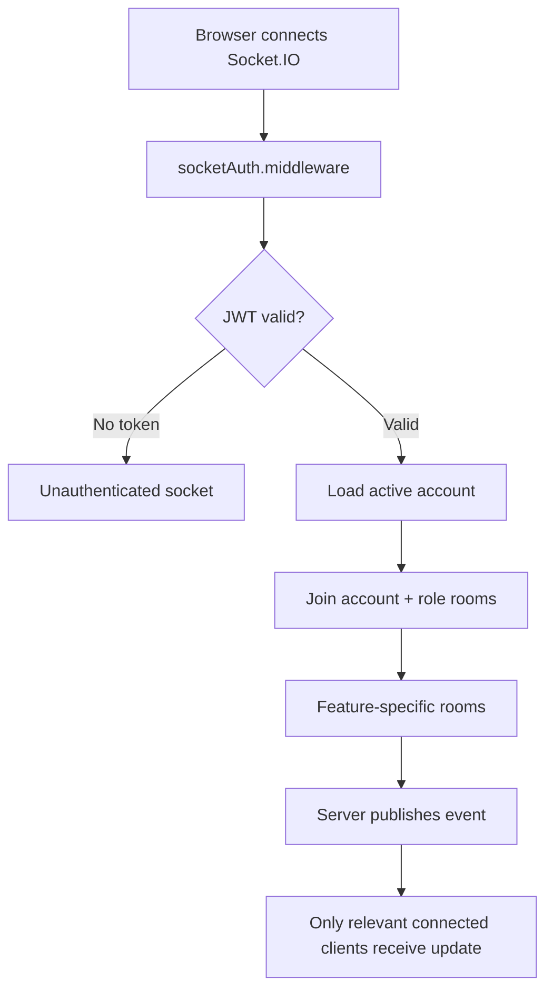

### Room examples

| Room | Purpose |
|---|---|
| `account:ROLE:ID` | Events for one logged-in account. |
| `role:DISASTER_MANAGER` | Events for all connected Disaster Managers. |
| `trip:TRIP_ID` | Live tracking events for authorized trip participants. |
| `group:GROUP_ID` | Live location updates for a group. |
| `incident:INCIDENT_ID` | Updates for one incident. |
| `tourist:USER_ID` | Tourist-specific location updates. |

### Events currently published include

- `location:updated`
- `incident:created`
- `incident:updated`
- `incident:message`
- `evidence:created`
- `notification:created`
- `risk-zone:updated`
- `dispatch:updated`
- `emergency-unit:updated`
- `blockchain:integrity`

### Security

Joining a tracking or incident room is not based only on knowing its ID. Gateways check whether the authenticated user is actually allowed to access the trip or incident.

### Important files

- `server/src/realtime/socketServer.js`
- `server/src/realtime/socketAuth.middleware.js`
- `server/src/realtime/tracking.gateway.js`
- `server/src/realtime/incident.gateway.js`
- `server/src/realtime/locationPublisher.js`
- `server/src/realtime/realtimePublisher.js`

**SIH explanation:** “REST gives us authoritative state and Socket.IO pushes live changes such as locations, incidents, notifications, and dispatch updates.”

---

## 8. Redis / Upstash Cache

Redis is used as a **performance cache**, not as the permanent database. The current backend talks to **Upstash Redis through its REST API**.

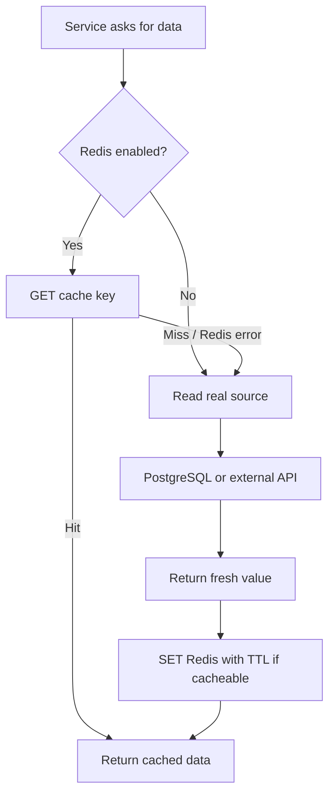

### What is cached

The backend uses cache helpers for selected read-heavy information such as:

- dashboard data
- destination data
- risk/safety-zone reads
- Disaster Management Google Places results by jurisdiction
- analytics data

### What is deliberately not treated as Redis truth

Critical live state such as SOS, incident status, dispatch state, group membership, and permanent trip state remains in PostgreSQL. Redis failure should degrade performance, not break correctness.

### Cache invalidation

When safety/risk zones change, related Redis keys are deleted so users do not keep receiving stale zone data until the TTL expires.

### Extra protection: in-flight request coalescing

If many identical cache misses happen inside one Node.js process at the same time, `cacheGetOrSet` shares one pending fetch instead of sending identical work repeatedly to PostgreSQL or an external provider.

### Important files

- `server/src/config/redis.js`
- `server/src/common/cache/cache.js`
- `server/src/common/cache/domain-cache.js`

**SIH explanation:** “Redis speeds up safe read-heavy workloads, while PostgreSQL remains the source of truth. If Redis fails, the backend falls back to the real source.”

---

# Location and Mapping Services

## 9. Google Maps / Google Places Service

The current backend actively uses the **Google Places API (New)** for Disaster Management jurisdiction lookups. It searches for nearby categories in a jurisdiction and normalizes the returned place data.

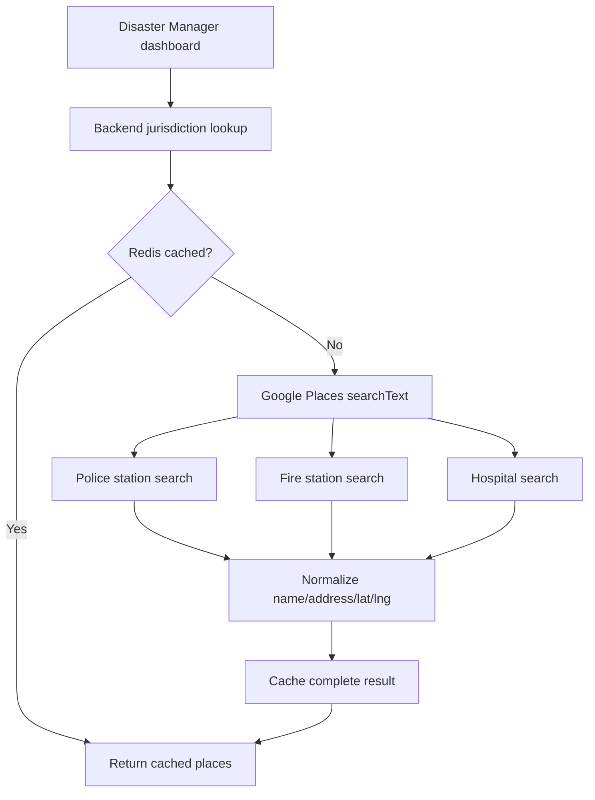

### API call used by the backend

The active service sends `POST` requests to Google Places API (New):

`https://places.googleapis.com/v1/places:searchText`

The API key stays in the backend as `GOOGLE_MAPS_API_KEY`.

### Failure behavior

A failure in one category does not take down the whole Disaster Management dashboard. The failed category returns an empty list, and degraded results are intentionally not cached for hours.

### Important file

- `server/src/modules/disaster-management/jurisdiction-places.service.js`

### Important implementation note

Files under `server/src/integrations/google-maps/` (`googleMaps.client.js`, `places.adapter.js`, `geocoding.adapter.js`, `directions.adapter.js`) currently exist as empty placeholders in this codebase. The actual active server-side Places logic is in `jurisdiction-places.service.js`.

**SIH explanation:** “On the backend, Google Places is used by Disaster Management to discover police stations, fire stations, and hospitals for a jurisdiction, with Redis caching to reduce repeated provider calls.”

---

## 10. Geocoding

**Server-side geocoding is not currently implemented through the placeholder `geocoding.adapter.js`.** Therefore, do not claim that this backend converts arbitrary addresses to coordinates through that adapter today.

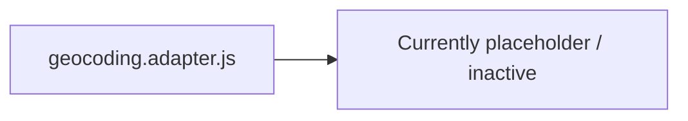

The system does use latitude/longitude heavily after coordinates are available, and the frontend/map stack can separately use Google Maps browser capabilities. But this backend guide distinguishes those from an active server-side geocoder.

**SIH explanation:** “Our backend currently consumes coordinates for safety calculations; the checked-in server geocoding adapter is a placeholder and is not part of the active request path.”

---

## 11. Geospatial Distance Calculation

KAVACH performs important safety calculations itself instead of asking Google Maps for every distance. It uses the **Haversine formula** for straight-line geographic distance between latitude/longitude coordinates.

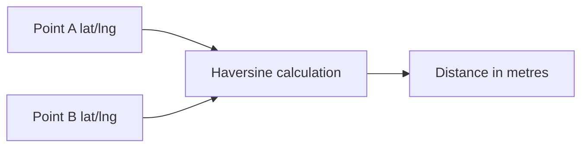

### Where this is used

- duplicate/unrealistic tracking checks
- group safety separation
- dynamic group centroid clustering
- circle-based zone checks
- monitoring calculations

### Important files

- `server/src/common/utils/geo.js`
- `server/src/common/utils/geoDistance.js`

**SIH explanation:** “For safety distance rules we use Haversine distance locally, so every check does not require an external Maps API call.”

---

## 12. Geofencing and Risk-Zone Detection

KAVACH supports both **circular** and **polygon** safety/risk zones. The backend checks whether a tourist location is inside a zone and can also test whether a safety circle intersects a danger zone.

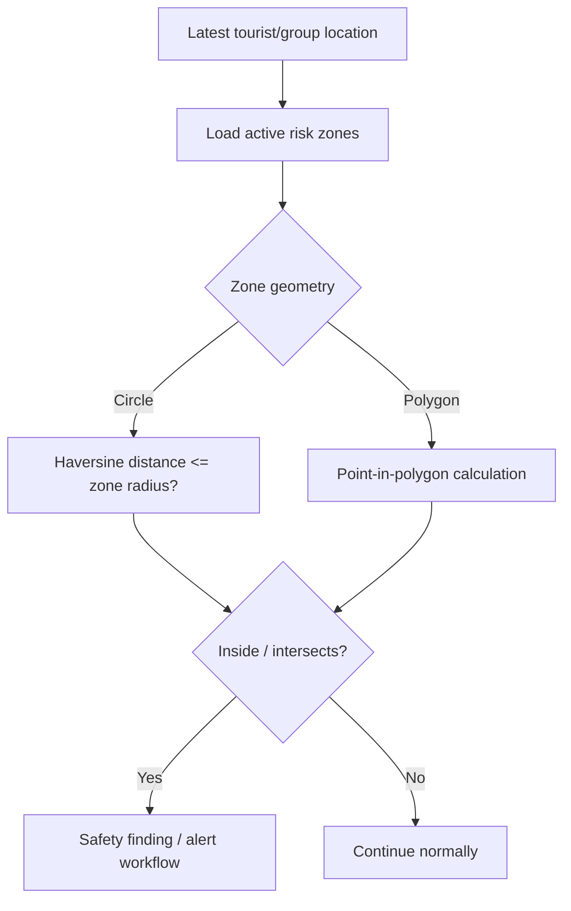

### Group-start safety boundary

For some safety checks a circular safety area can be compared against risk zones using `zoneIntersectsCircle`, rather than checking only one exact point.

### Important files

- `server/src/common/utils/geofence.js`
- `server/src/modules/risk-zone/risk-zone.service.js`
- `server/src/modules/safety/safety.service.js`
- `server/src/modules/dashboard/dashboard.service.js`

> The folder `server/src/modules/geofence/` currently contains placeholder files; the active geometry logic lives mainly in `common/utils/geofence.js` and the safety/risk-zone services.

**SIH explanation:** “Geofencing is calculated inside our backend using circle distance and point-in-polygon logic, then the safety services decide what alert should be generated.”

---

## 13. Dynamic Group-Centroid Safety Geofence

Group separation uses a **dynamic 500 m safety radius around the majority group's centroid**, not around the leader.

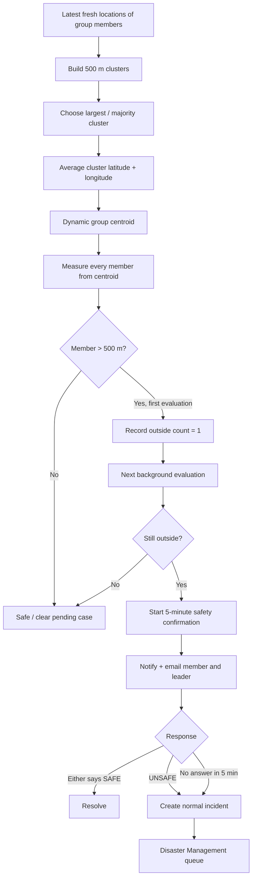

### Why use the majority cluster first?

If four members are together and one member is far away, a simple average of all five points would move the center toward the separated person. The majority-cluster step prevents the outlier from moving the safety center toward itself.

### Important service

- `server/src/modules/signal-loss/signal-loss.service.js`

**SIH explanation:** “We find the densest member cluster first, calculate its moving centroid, and only trigger confirmation after a member is outside 500 m for two consecutive evaluations.”

---

## 14. Tracking Ingestion + Location Quality Checks

Location updates are accepted by the tracking module, stored as trusted tracking points, and then broadcast in real time. The service also checks movement information so obviously problematic or duplicate points do not become useful safety data.

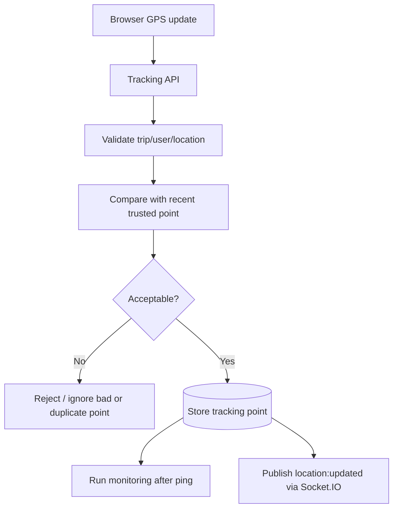

### Important files

- `server/src/modules/tracking/tracking.service.js`
- `server/src/modules/tracking/tracking.repository.js`
- `server/src/realtime/locationPublisher.js`

**SIH explanation:** “GPS points are validated and persisted before being used for safety or realtime tracking; Socket.IO then pushes accepted updates to authorized viewers.”

---

# Safety Automation Services

## 15. Monitoring Service

The monitoring service evaluates active-trip safety conditions. It can detect trip overtime, tracking interruption, and planned-route deviation, while specialized workflows handle solo signal loss and group separation.

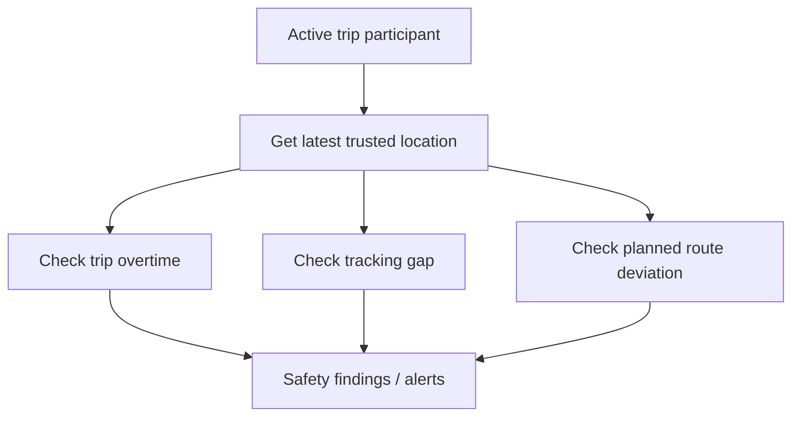

### Planned-route deviation

If a planned route exists, the backend calculates the shortest distance from the current point to route segments. When the distance exceeds the configured corridor threshold, a route-deviation alert can be generated.

### Important files

- `server/src/modules/monitoring/monitoring.service.js`
- `server/src/common/utils/routeDistance.js`

---

## 16. Signal-Loss Background Service

Signal-loss logic is not dependent on a tourist manually opening a page. A background job runs every **30 seconds** and checks active trips for missing-location and group-separation conditions.

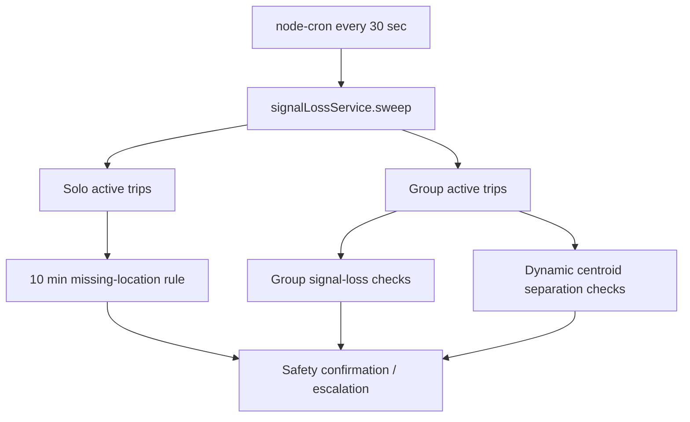

### Solo missing-person flow

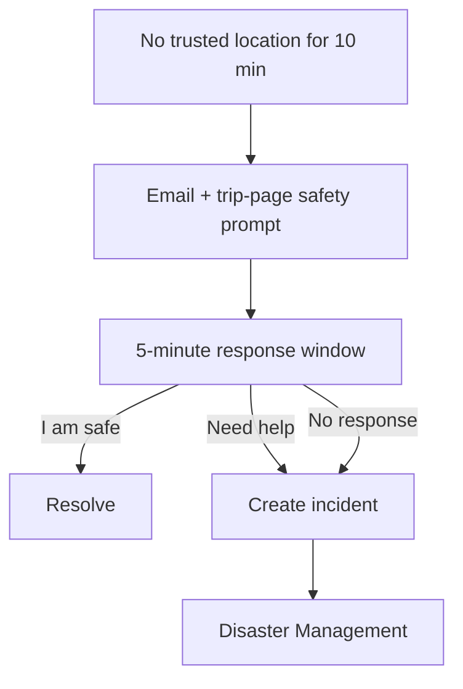

### Important files

- `server/src/jobs/signalLoss.job.js`
- `server/src/modules/signal-loss/signal-loss.service.js`
- `server/src/modules/signal-loss/signal-loss.repository.js`

---

## 17. SafetyAlert → Incident → Disaster Management Pipeline

KAVACH separates a **possible safety problem** from a confirmed/escalated incident. This is important for reducing false positives.

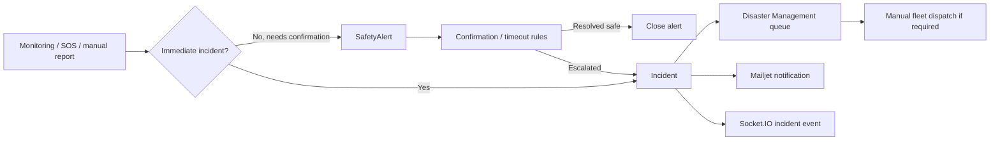

### Why this separation matters

A temporary GPS/network problem should not immediately dispatch emergency resources. SafetyAlert gives automated detection a confirmation stage; Incident means the problem has reached Disaster Management handling.

### Important modules

- `signal-loss`
- `monitoring`
- `incident`
- `disaster-management`
- `notification`
- `dispatch`

**SIH explanation:** “We automate detection and escalation but keep physical fleet dispatch under Disaster Management control.”

---

# External and Supporting Services

## 18. Cloudinary File Upload Service

Cloudinary is used for selected user-facing uploaded files such as tourist profile images, medical documents, and destination images. The server signs upload parameters using the Cloudinary API secret and sends the file directly from backend memory.

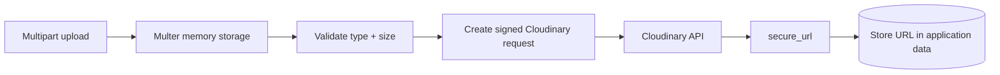

### Important files

- `server/src/middleware/upload.middleware.js`
- `server/src/integrations/cloudinary/cloudinary.adapter.js`

**SIH explanation:** “The client sends the file to our backend; we validate it and use a server-side signed Cloudinary upload so the Cloudinary secret never reaches the browser.”

---

## 19. Evidence Storage

Incident/hazard evidence uses Multer for upload validation and a storage adapter. The current `objectStorage.adapter.js` implementation writes evidence bytes to the configured server storage directory using a random storage key.

```mermaid
flowchart LR
    A[Evidence upload] --> B[Multer validation]
    B --> C[Evidence service]
    C --> D[Object storage adapter]
    D --> E[Configured evidence storage directory]
    C --> F[(Evidence metadata in PostgreSQL)]
```

This is different from the Cloudinary profile/medical/destination upload path.

### Important files

- `server/src/modules/evidence/evidence.upload.js`
- `server/src/integrations/storage/objectStorage.adapter.js`
- `server/src/modules/evidence/evidence.service.js`

---

## 20. AI Trip-Planner Integration

The main backend does not generate itineraries itself. It calls the separate Python FastAPI trip-planner service over HTTP.

```mermaid
flowchart TD
    A[Tourist chooses Plan with AI] --> B[Main Express backend]
    B --> C[Validate trip/group planning rules]
    C --> D[HTTP POST to FastAPI /api/trip/plan]
    D --> E[FastAPI planner]
    E --> F[SerpAPI + Groq]
    F --> G[Structured itinerary response]
    G --> B
    B --> H[Attach plan to trip / continue flow]
```

### Reliability behavior

- production configuration rejects a localhost planner URL
- requests have a configurable timeout
- transient network/5xx failures get one retry
- invalid planner responses are rejected

### Important file

- `server/src/integrations/ai/trip-planner.service.js`

**SIH explanation:** “The safety backend and AI planner are separate services; if AI is unavailable, core safety APIs do not have to fail with it.”

---

## 21. Blockchain Gateway + Background Queue

The main backend does not hold the blockchain issuer private key. It sends protected HTTP requests to a separate blockchain gateway, which signs blockchain transactions.

```mermaid
flowchart TD
    A[Credential / snapshot change] --> B[(PostgreSQL)]
    B --> C[Create blockchain anchor job]
    C --> D[blockchainAnchor background worker]
    D --> E[Blockchain Gateway HTTP API]
    E --> F[ethers.js]
    F --> G[TrustAnchor.sol]
    G --> H[Ethereum-compatible chain]
    H --> I[Transaction result]
    I --> J[Update job + credential chain status]
```

### Why a queue is used

Blockchain writes can be slow or temporarily fail. The application records work as jobs and retries retryable failures instead of forcing every normal user request to wait for chain confirmation.

### Security boundary

The main backend has the gateway API key. The dedicated blockchain gateway owns the issuer private key. The browser gets neither.

### Important files

- `server/src/integrations/blockchain/blockchain.service.js`
- `server/src/integrations/blockchain/blockchain.queue.js`
- `server/src/jobs/blockchainAnchor.job.js`
- `server/src/jobs/blockchainIntegrity.job.js`

---

## 22. QR Credential Service

Trip credentials can be represented as signed QR verification URLs. The backend signs a short-lived credential token and uses the `qrcode` package to generate a QR image data URL.

```mermaid
flowchart LR
    A[Trip credential] --> B[Sign credential JWT]
    B --> C[Build verification URL]
    C --> D[Generate QR code]
    D --> E[Client displays QR]
    E --> F[Verifier opens signed URL]
```

Group credentials can also create a signed group-join URL/token.

### Important file

- `server/src/modules/credential/credential.service.js`

---

# Backend Security Layer

## 23. Zod Request Validation

Every client is untrusted, even the official frontend. Zod schemas validate body, query, and route parameters before controllers/services use them.

```mermaid
flowchart LR
    A[Incoming request] --> B[Zod schema]
    B -->|Invalid| C[400 Validation Error]
    B -->|Valid| D[Sanitized parsed data]
    D --> E[Controller]
```

### Important files

- `server/src/middleware/validate.middleware.js`
- `server/src/modules/*/*.validation.js`

---

## 24. Role-Based Authorization

After authentication, KAVACH checks whether the account's role is allowed to perform an action. Authentication answers “who are you?”; authorization answers “are you allowed to do this?”

```mermaid
flowchart LR
    A[Valid authenticated user] --> B[authorize middleware]
    B --> C{Role allowed?}
    C -->|Yes| D[Feature handler]
    C -->|No| E[403 Forbidden]
```

Roles include Tourist, Disaster Manager, System Admin, Police, Fire, and Ambulance accounts.

### Important file

- `server/src/middleware/authorize.middleware.js`

---

## 25. Helmet, CORS, Rate Limiting, and Request Hardening

Several smaller services protect the HTTP boundary before business code is reached.

```mermaid
flowchart TD
    A[Internet request] --> B[Request ID]
    B --> C[Pino HTTP logging]
    C --> D[Helmet security headers]
    D --> E[CORS origin policy]
    E --> F[Body size / parser limits]
    F --> G[Request object-depth/key checks]
    G --> H[API rate limiter]
    H --> I[Sensitive-action rate limiter]
    I --> J[Route + feature middleware]
```

### What they do

| Service | Purpose |
|---|---|
| Helmet | Sends safer HTTP security headers and disables common browser embedding/resource behaviors. |
| CORS | Controls which frontend origins can call the API from browsers. |
| Rate limiting | Limits request volume and applies tighter protection to sensitive mutations such as auth, SOS, evidence, admin, and integration endpoints. |
| Request hardening | Rejects dangerous keys like `__proto__`, excessive nesting, and excessive object fields. |
| Body limits | Prevents unexpectedly huge normal JSON/urlencoded requests. |
| Privacy headers | Uses `no-store` for API responses so sensitive API data is not casually browser/proxy cached. |

### Important files

- `server/src/config/security.js`
- `server/src/config/cors.js`
- `server/src/middleware/rateLimiter.middleware.js`
- `server/src/middleware/requestSecurity.middleware.js`

---

# Operations and Reliability

## 26. Background Jobs / node-cron

Some rules must run even when no HTTP request arrives. KAVACH starts background workers when `server.js` starts.

```mermaid
flowchart TD
    A[server.js starts] --> B[Trip lifecycle job]
    A --> C[Signal-loss job]
    A --> D[Blockchain anchor worker]
    A --> E[Blockchain integrity job]

    B --> F[Auto-complete expired trips + reminders + cleanup]
    C --> G[Missing-location + group safety sweeps]
    D --> H[Process pending blockchain jobs]
    E --> I[Reconcile blockchain integrity]
```

### Active startup jobs

| Job | Current role |
|---|---|
| `tripLifecycleJob` | Runs frequently to complete expired trips, clean ended-trip safety state, and send roughly 30-minute trip-ending reminders. |
| `signalLossJob` | Runs every 30 seconds for solo/group safety escalation and dynamic centroid separation. |
| `blockchainAnchorJob` | Processes queued blockchain writes when blockchain support is enabled. |
| `blockchainIntegrityJob` | Runs every 5 seconds to reconcile open blockchain-integrity state. |

Some other files under `server/src/jobs/` currently exist as empty placeholders and are not started by `server.js`.

---

## 27. Pino Logging + Request IDs + Metrics

Every HTTP request receives a request ID. Pino records structured logs and automatically redacts sensitive fields such as authorization headers, cookies, passwords, access tokens, and refresh tokens.

```mermaid
flowchart LR
    A[HTTP request] --> B[Generate / accept safe X-Request-ID]
    B --> C[Observability timer]
    C --> D[Pino HTTP logger]
    D --> E[Route processing]
    E --> F[Status + duration metrics]
    E --> G[Structured log linked by requestId]
```

### Why this matters

When a request fails in production, the same request ID can connect the client-visible response to server logs without printing secret credentials into logs.

### Important files

- `server/src/config/logger.js`
- `server/src/middleware/requestId.middleware.js`
- `server/src/middleware/observability.middleware.js`
- `server/src/observability/metrics.js`

---

## 28. Graceful Startup and Shutdown

`server.js` coordinates the database, HTTP server, Socket.IO, and active background jobs.

```mermaid
flowchart TD
    A[Process starts] --> B[Connect PostgreSQL]
    B --> C[Create HTTP server]
    C --> D[Create Socket.IO if enabled]
    D --> E[Start listening]
    E --> F[Start background jobs]

    G[SIGTERM / SIGINT] --> H[Stop background jobs]
    H --> I[Close Socket.IO]
    I --> J[Close HTTP server]
    J --> K[Disconnect PostgreSQL]
```

This is important on Render or during deployments because the process attempts to stop accepting work and close resources instead of simply disappearing in the middle of operations.

### Important file

- `server/src/server.js`

---

# What Is Installed vs What Is Actually Active?

This distinction is useful during SIH questioning. A package existing in `package.json` does not automatically mean the current runtime uses it.

| Technology/file | Current backend status |
|---|---|
| Mailjet HTTP Send API | **Active** for transactional email. |
| Nodemailer | Package installed, but **not the current Mailjet delivery path**. |
| Socket.IO | **Active** when `SOCKET_IO_ENABLED` is enabled. |
| Upstash Redis REST | **Active when configured/enabled**; optional fail-open cache. |
| PostgreSQL + Prisma | **Core active source of truth**. |
| Argon2id | **Active** for password hashing/verification. |
| JWT | **Active** for access, refresh, and credential-related signed tokens. |
| Google Places API (New) | **Active** in Disaster Management jurisdiction lookup. |
| `integrations/google-maps/geocoding.adapter.js` | Present but **currently empty/inactive**. |
| `integrations/google-maps/directions.adapter.js` | Present but **currently empty/inactive**. |
| Custom geofence/Haversine utilities | **Active** in safety/risk/location logic. |
| Cloudinary | **Active when configured** for profile, medical-document, and destination-image uploads. |
| Local evidence object-storage adapter | **Active implementation** for evidence storage path. |
| FastAPI AI trip planner | **Active external service integration when configured**. |
| Blockchain gateway | **Active when blockchain is enabled**. |
| Firebase Admin / push adapter | Dependency exists, but current `push.adapter.js` is **empty/inactive**. |

---

# One-Minute Architecture Explanation for SIH

```mermaid
flowchart TB
    FE[React / Vercel Frontend]
    API[Node.js + Express Backend]
    DB[(PostgreSQL + Prisma)]
    REDIS[Upstash Redis]
    SOCKET[Socket.IO]
    MAIL[Mailjet HTTPS API]
    MAPS[Google Places API]
    AI[FastAPI AI Planner]
    BC[Blockchain Gateway]
    CLOUD[Cloudinary]

    FE -->|REST + JWT| API
    FE <-->|Realtime| SOCKET
    SOCKET --- API
    API --> DB
    API -. selected cached reads .-> REDIS
    API -->|transactional emails| MAIL
    API -->|DM place lookup| MAPS
    API -->|AI itinerary request| AI
    API -->|queued integrity operations| BC
    API -->|signed media uploads| CLOUD
```

A concise explanation:

> “KAVACH uses Node.js and Express as the main safety backend with PostgreSQL and Prisma as the permanent source of truth. JWT and Argon2id secure authentication, Zod and HTTP middleware validate and protect requests, Socket.IO handles real-time tracking and incident events, and Redis caches selected read-heavy data. Geospatial safety rules such as geofencing and the dynamic group centroid are calculated in the backend using latitude/longitude math. Mailjet handles transactional email through HTTPS, Google Places provides emergency-service discovery for Disaster Management, Cloudinary handles selected uploads, while AI and blockchain are isolated behind separate services.”

---

# Fast Interview Cheat Sheet

| If asked... | Short answer |
|---|---|
| How do emails work? | Backend sends HTTPS requests directly to Mailjet Send API v3.1 using server-side API credentials. |
| SMTP or HTTP? | HTTP API, not SMTP in the current implementation. |
| Why Redis? | To cache selected read-heavy data; PostgreSQL remains the source of truth. |
| How is login secured? | Argon2id password hashes + JWT access/refresh tokens + persisted refresh sessions. |
| How are refresh tokens protected? | The backend stores a SHA-256 hash of the token and rotates it after refresh. |
| Why WebSockets? | Socket.IO pushes location, incident, notification, and dispatch changes in real time. |
| How is WebSocket access secured? | Socket handshake JWT verification plus database account checks and authorized rooms. |
| How does geofencing work? | Custom circle/Haversine and polygon geometry checks in the backend. |
| How does group separation work? | Dynamic centroid from the largest member cluster, 500 m radius, two consecutive detections, then a 5-minute confirmation window. |
| What Google API is active server-side? | Google Places API (New) for Disaster Management police/fire/hospital jurisdiction lookup. |
| Does server-side geocoding currently run? | No; the checked-in geocoding adapter is currently a placeholder. |
| Why separate SafetyAlert and Incident? | To confirm noisy/automatic safety signals before escalating them to Disaster Management. |
| Is dispatch automatic? | No; detection can be automatic, but Disaster Management chooses the final fleet dispatch. |
| Where is the blockchain private key? | In the separate blockchain gateway, not the browser or normal frontend. |
| What happens if Redis fails? | Cache calls fall back to the source of truth; correctness should continue. |
| What happens if AI fails? | Core safety backend remains separate; the planner integration can fail without taking down safety functionality. |

---

## Final Mental Model

Think of the backend as four layers of responsibility:

```text
SECURITY
JWT + Argon2 + Zod + Helmet + CORS + Rate Limits
                ↓
CORE APPLICATION
Trips + Groups + Tracking + Safety + Incidents + Dispatch
                ↓
DATA / REALTIME
PostgreSQL + Prisma + Redis + Socket.IO
                ↓
EXTERNAL SERVICES
Mailjet + Google Places + Cloudinary + AI Planner + Blockchain Gateway
```

That is the easiest way to explain the system during an SIH review without trying to recite the entire repository like a particularly unfortunate phone book.
